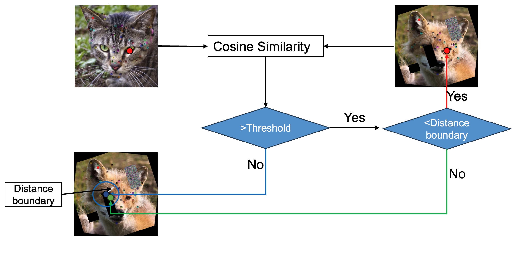

# IP_dino

We focus on exploring robust semantic correspondence between image pairs using dense visual descriptors extracted from Vision Transformers (ViTs). The system improves robustness under symmetry, unknown rotations, and partial occlusions — common challenges in biomedical imaging and robotics.

The key insight:DINO and DINOv2 descriptors perform poorly under rotational ambiguity. To address this, we:

1. Rotate the target image across candidate angles.

2. Select the optimal orientation based on the number of confident landmark matches.

3. Apply Thin Plate Spline (TPS) warping to align the two images geometrically.



## Setup
```
$ pip install -r requirement.txt
```

You can specify the pretrained model using the `--model_type` flag with the following options:
* `dino_vits8`, `dino_vits16`, `dino_vitb8`, `dino_vitb16` from the [DINO repo](https://github.com/facebookresearch/dino).
* `dinov2_bits14`, `dinov2_bitb14`, `dinov2_bitl14`, `dinov2_bitg14` from the [Dinov2 repo](https://github.com/facebookresearch/dinov2)

## Correspondent point matching using dinov2 models
```code
python matching_dinov2.py ---image_a <image_a_path> --image_b <image_b_path>
```

## ip_dino
This script will do:
* Extracts descriptors from image pairs

* Handles target image rotation (up to num_rotation)

* Selects optimal orientation

* Applies landmark matching and ambiguity resolution using TPS

* Generates interactive plots for visual inspection

Usage:
```code
python ip_dino.py ---image_a <image_a_path> --image_b <image_b_path>
```
Options:\
`--image_b`: You can also input a folder path, the script will iterate the images in the folder;\
`--num_rotation`: The trials of rotations, recommended 4 or 8;\
`--mask_file`: You can provide a black and white mask file to focus on the main subject\
...


## ViT Extractor

### Code Snippet
```
from extractor import ViTExtractor
extractor = ViTExtractor()
# imgs should be imagenet normalized tensors. shape BxCxHxW
descriptors = extractor.extract_descriptors(imgs) 
```
---
You can use wrapper class for a ViT model to extract dense visual descriptors in `extractor.py`.
You can extract descriptors to `.pt` files using the following command:
```
python extractor.py --image_path <image_path> --output_path <output_path>
```
## App
A gradio based web app is available by running
```code
python app/app.py
```
